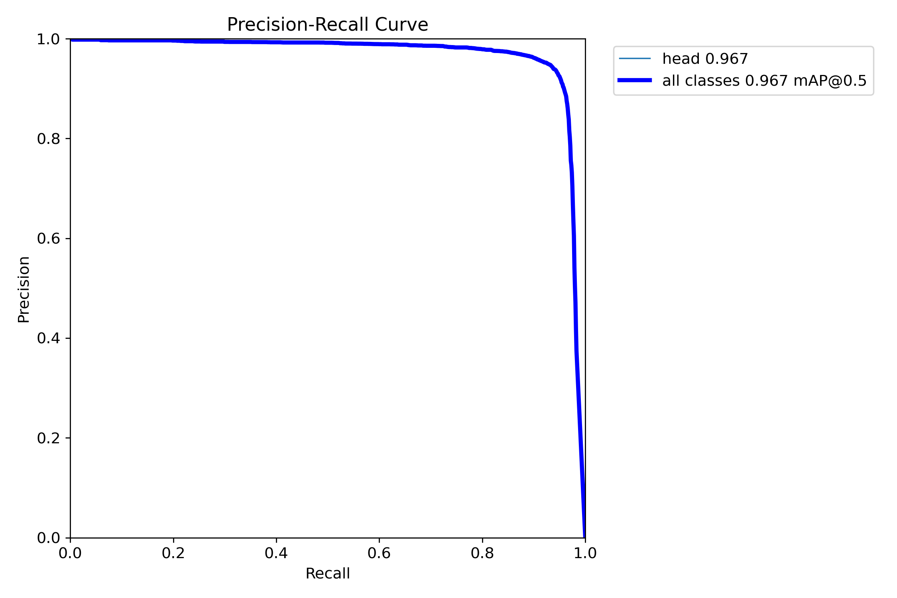

# Head Detection with YOLO

Bu depo, **Ultralytics YOLO** tabanlı bir **head detection (kafa tespiti)** sistemi geliştirmek amacıyla oluşturulmuştur. Çalışma; veri hazırlama, model eğitimi, değerlendirme (metrik ve sayım bazlı) ve sonuçların görselleştirilmesi aşamalarını içeren **uçtan uca (end‑to‑end)** bir yapıya sahiptir.

Repo, akademik raporlama ve endüstriyel PoC (proof‑of‑concept) senaryolarına uygun olacak şekilde **aşamalı (stage‑based)** ve düzenli biçimde yapılandırılmıştır.

---

## Temel Özellikler

* Ultralytics YOLO (YOLOv8) tabanlı head detection modeli
* Aşamalı deney yapısı (training → evaluation → inference)
* Conf / IoU eşiklerine bağlı performans karşılaştırmaları
* Ground Truth vs Prediction sayım analizi
* Görsel sonuçlar ve model logları ile şeffaf deney takibi

---

## Proje Klasör Yapısı

```text
Head_Detection/
├── first_stage/        # Veri hazırlama ve ön işlemler
├── second_stage/       # Model eğitimi (training)
├── third_stage/        # Nihai değerlendirme ve sonuçlar
│   ├── result.png      # Model çıktılarının görsel özeti
│   ├── *.log           # Eğitim / değerlendirme log dosyaları
│   └── outputs/        # Tahmin sonuçları (txt / görsel)
├── dataset.yaml        # YOLO veri yapılandırması
└── README.md
```

> **Not:** `third_stage` klasörü, çalışmanın en kritik çıktılarının bulunduğu aşamadır.

---

## Third Stage – Nihai Sonuçlar

### 🔹 Görsel Sonuç

Aşağıdaki görsel, modelin head detection performansını ve sayım davranışını özetlemektedir:



Bu görselde:

* Precision–Recall dengesi
* Farklı eşik değerlerinde model davranışı
* Genel tespit kalitesi

açık biçimde gözlemlenebilir.

---

### 🔹 Nicel Metrikler ve Karışıklık Matrisi

Modelin nicel performansı ve sınıf bazlı davranışı aşağıdaki görseller ile özetlenmiştir.

#### 📊 Precision–Recall Eğrisi


Bu eğri, modelin farklı confidence eşiklerinde precision–recall dengesini göstermektedir ve nesne tespit literatüründe standart bir değerlendirme aracıdır.

---

#### 🧩 Normalize Confusion Matrix


Normalize edilmiş confusion matrix, sınıf dengesizliğinin etkisini azaltarak modelin gerçek tespit davranışını daha net biçimde ortaya koyar. Bu sunum biçimi özellikle akademik raporlamada tercih edilmektedir.

---

> Sayısal metrikler (mAP@0.5:0.95, Precision, Recall) Ultralytics tarafından üretilen `results.csv` dosyasından elde edilmiştir ve deneyin tekrar üretilebilirliğini garanti altına alır.

---

## Kullanılan Teknolojiler

* **Python 3.9+**
* **Ultralytics YOLOv8**
* PyTorch
* NumPy / Pandas
* OpenCV

---

##

```bash
```

---

## Eğitim (Training)

```bash
yolo detect train \
  data=dataset.yaml \
  model=yolov8n.pt \
  imgsz=960 \
  epochs=80 \
  batch=8
```

---

## Değerlendirme (Evaluation)

Model çıktıları, **conf / IoU eşiklerine göre** değerlendirilmiş ve sayım hataları analiz edilmiştir.

Öne çıkan metrikler:

* MAE (Mean Absolute Error)
* RMSE (Root Mean Square Error)
* Toplam GT vs Prediction farkı

Detaylı sonuçlar `third_stage` altında bulunmaktadır.

---

## Amaç ve Kullanım Alanları

Bu proje özellikle:

* Kalabalık sahnelerde insan sayımı
* CCTV / güvenlik sistemleri
* Akıllı şehir uygulamaları
* Yoğunluk analizi

gibi senaryolara yönelik bir **referans** olarak tasarlanmıştır.

---

## Lisans

Bu proje akademik ve kişisel kullanım için açıktır. Ticari kullanım öncesi ilgili lisans koşullarını gözden geçiriniz.

---

## İletişim

Geliştirici: **Hüseyin DGN**
GitHub: [https://github.com/huseyin-dgn](https://github.com/huseyin-dgn)
